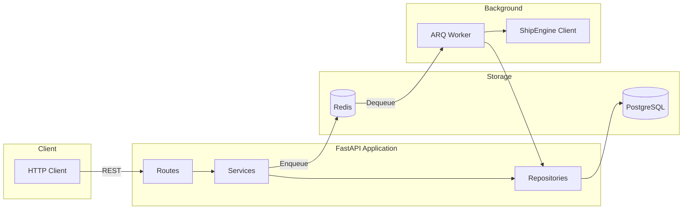

# ShipEngine Address Validation Service

[](https://github.com/user/repo/actions)
[](https://codecov.io/gh/user/repo)
[](https://www.python.org/downloads/)
[](https://fastapi.tiangolo.com)
[](LICENSE)
[](https://github.com/astral-sh/ruff)

> Async address validation microservice with background processing

Production-ready FastAPI service for validating shipping addresses via ShipEngine API. Features async PostgreSQL storage, Redis-backed task queue (ARQ), and comprehensive validation with address normalization.

## Table of Contents

- [Features](#features)
- [Tech Stack](#tech-stack)
- [Prerequisites](#prerequisites)
- [Quick Start](#quick-start)
- [Development](#development)
- [API Reference](#api-reference)
- [Architecture](#architecture)
- [Configuration](#configuration)
- [Testing](#testing)
- [Docker](#docker)
- [Project Structure](#project-structure)
- [Troubleshooting](#troubleshooting)
- [Contributing](#contributing)
- [License](#license)

## Features

- **Async-first** — Built on FastAPI with full async/await support
- **Background validation** — Non-blocking address validation via ARQ workers
- **Address normalization** — Automatic formatting of streets, cities, postal codes
- **Validation status tracking** — PENDING → VERIFIED/WARNING/ERROR states
- **Pagination** — Efficient listing with limit/offset
- **Health checks** — Liveness and readiness probes for Kubernetes
- **Type-safe** — Full type hints with Pydantic v2 validation
- **Production-ready** — Docker multi-stage builds, proper error handling

## Tech Stack

| Component | Technology | Version |
|-----------|------------|---------|
| Web Framework | [FastAPI](https://fastapi.tiangolo.com) | 0.115+ |
| ORM | [SQLAlchemy](https://www.sqlalchemy.org) (async) | 2.0+ |
| Database | [PostgreSQL](https://www.postgresql.org) | 16+ |
| DB Driver | [asyncpg](https://github.com/MagicStack/asyncpg) | 0.30+ |
| Task Queue | [ARQ](https://arq-docs.helpmanual.io) | 0.26+ |
| Cache/Queue | [Redis](https://redis.io) | 7+ |
| Validation | [Pydantic](https://docs.pydantic.dev) | 2.10+ |
| Migrations | [Alembic](https://alembic.sqlalchemy.org) | 1.14+ |

## Prerequisites

Before you begin, ensure you have the following installed:

- **Python 3.12+** — [Download](https://www.python.org/downloads/)
- **Docker & Docker Compose** — [Install Docker](https://docs.docker.com/get-docker/)
- **uv** (recommended) — Fast Python package manager
  ```bash
  curl -LsSf https://astral.sh/uv/install.sh | sh
  ```

## Quick Start

### Using Docker (recommended)

```bash
# Clone the repository
git clone https://github.com/user/shipengine-validation.git
cd shipengine-validation

# Copy environment file
cp .env.example .env

# Start all services
docker compose up -d

# Run database migrations
docker compose exec app alembic upgrade head

# Verify installation
curl http://localhost:8000/api/v1/health
```

**Expected response:**
```json
{"status": "ok"}
```

### API Documentation

Once running, access the interactive docs:

- **Swagger UI:** http://localhost:8000/docs
- **ReDoc:** http://localhost:8000/redoc

## Development

### Local Setup

```bash
# Install dependencies
uv sync --all-extras

# Start PostgreSQL and Redis (via Docker)
docker compose up -d db redis

# Run migrations
uv run alembic upgrade head

# Start the API server
uv run uvicorn src.main:app --reload

# In a separate terminal, start the worker
uv run arq src.workers.settings.WorkerSettings
```

### Code Quality

```bash
# Lint code
uv run ruff check src tests

# Format code
uv run ruff format src tests

# Type checking
uv run mypy src

# Run all checks
uv run ruff check src tests && uv run ruff format --check src tests && uv run mypy src
```

## API Reference

Base URL: `http://localhost:8000/api/v1`

### Endpoints Overview

| Method | Endpoint | Description |
|--------|----------|-------------|
| `POST` | `/addresses` | Create address + enqueue validation |
| `GET` | `/addresses` | List addresses (paginated) |
| `GET` | `/addresses/{id}` | Get address with validation results |
| `PUT` | `/addresses/{id}` | Update address + re-validate |
| `DELETE` | `/addresses/{id}` | Delete address |
| `POST` | `/addresses/{id}/validate` | Trigger re-validation |
| `GET` | `/health` | Liveness check |
| `GET` | `/health/ready` | Readiness check (includes DB) |

### Create Address

```bash
curl -X POST http://localhost:8000/api/v1/addresses \
  -H "Content-Type: application/json" \
  -d '{
    "name": "John Doe",
    "company_name": "Acme Corp",
    "address_line1": "123 Main Street",
    "city_locality": "Austin",
    "state_province": "TX",
    "postal_code": "78701",
    "country_code": "US"
  }'
```

**Response (201 Created):**
```json
{
  "id": "550e8400-e29b-41d4-a716-446655440000",
  "name": "John Doe",
  "company_name": "Acme Corp",
  "address_line1": "123 Main Street",
  "city_locality": "Austin",
  "state_province": "TX",
  "postal_code": "78701",
  "country_code": "US",
  "validation_status": "pending",
  "validated_at": null,
  "created_at": "2024-01-15T10:30:00Z",
  "updated_at": null,
  "validation_results": []
}
```

### List Addresses

```bash
# Get first 10 addresses
curl "http://localhost:8000/api/v1/addresses?limit=10&offset=0"
```

**Response (200 OK):**
```json
{
  "items": [...],
  "total": 42,
  "limit": 10,
  "offset": 0
}
```

### Get Address by ID

```bash
curl http://localhost:8000/api/v1/addresses/550e8400-e29b-41d4-a716-446655440000
```

**Response (200 OK):**
```json
{
  "id": "550e8400-e29b-41d4-a716-446655440000",
  "validation_status": "verified",
  "validated_at": "2024-01-15T10:30:05Z",
  "validation_results": [
    {
      "id": "7c9e6679-7425-40de-944b-e07fc1f90ae7",
      "status": "verified",
      "matched_address": {
        "address_line1": "123 MAIN ST",
        "city_locality": "AUSTIN",
        "state_province": "TX",
        "postal_code": "78701",
        "country_code": "US"
      },
      "messages": [],
      "created_at": "2024-01-15T10:30:05Z"
    }
  ]
}
```

### Update Address

```bash
curl -X PUT http://localhost:8000/api/v1/addresses/550e8400-e29b-41d4-a716-446655440000 \
  -H "Content-Type: application/json" \
  -d '{
    "address_line1": "456 Oak Avenue",
    "city_locality": "Austin",
    "state_province": "TX",
    "postal_code": "78702",
    "country_code": "US"
  }'
```

> **Note:** Updating an address resets `validation_status` to `pending` and enqueues a new validation task.

### Delete Address

```bash
curl -X DELETE http://localhost:8000/api/v1/addresses/550e8400-e29b-41d4-a716-446655440000
```

**Response:** `204 No Content`

### Trigger Re-validation

```bash
curl -X POST http://localhost:8000/api/v1/addresses/550e8400-e29b-41d4-a716-446655440000/validate
```

**Response (200 OK):**
```json
{
  "message": "Validation task enqueued"
}
```

### Error Responses

| Status | Code | Description |
|--------|------|-------------|
| `400` | `BAD_REQUEST` | Invalid request body |
| `404` | `NOT_FOUND` | Address not found |
| `422` | `VALIDATION_ERROR` | Pydantic validation failed |
| `500` | `INTERNAL_ERROR` | Unexpected server error |

**Error Response Format:**
```json
{
  "detail": "Address with id=550e8400-... not found"
}
```

## Architecture



### Request Flow

1. **Client** sends `POST /api/v1/addresses` with address data
2. **Service** saves address with `validation_status=PENDING`
3. **Service** enqueues validation task to Redis via ARQ
4. **API** returns `201 Created` immediately (non-blocking)
5. **ARQ Worker** picks up the task and validates via ShipEngine
6. **Worker** saves `ValidationResult` and updates address status
7. **Client** polls `GET /api/v1/addresses/{id}` for updated status

### Validation States

```
PENDING → VERIFIED   (valid address)
PENDING → WARNING    (valid but has issues, e.g., PO Box)
PENDING → ERROR      (invalid address)
PENDING → FAILED     (validation service error)
```

## Configuration

### Environment Variables

| Variable | Default | Description |
|----------|---------|-------------|
| `APP_ENV` | `local` | Environment: `local`, `staging`, `production` |
| `DEBUG` | `true` | Enable debug mode (Swagger UI) |
| `POSTGRES_HOST` | `localhost` | PostgreSQL host |
| `POSTGRES_PORT` | `5432` | PostgreSQL port |
| `POSTGRES_USER` | `app` | PostgreSQL user |
| `POSTGRES_PASSWORD` | `secret` | PostgreSQL password |
| `POSTGRES_DB` | `shipengine` | PostgreSQL database name |
| `REDIS_URL` | `redis://localhost:6379/0` | Redis connection URL |

### Example `.env`

```env
APP_ENV=local
DEBUG=true

# Database
POSTGRES_HOST=localhost
POSTGRES_PORT=5432
POSTGRES_USER=app
POSTGRES_PASSWORD=secret
POSTGRES_DB=shipengine

# Redis
REDIS_URL=redis://localhost:6379/0
```

### Production Settings

For production deployments:

```env
APP_ENV=production
DEBUG=false
POSTGRES_PASSWORD=<secure-password>
```

## Testing

### Run All Tests

```bash
uv run pytest
```

### With Coverage

```bash
uv run pytest --cov=src --cov-report=term-missing --cov-report=html
```

Coverage report will be generated in `htmlcov/index.html`.

### Run Specific Tests

```bash
# Unit tests only
uv run pytest tests/unit -v

# Integration tests only
uv run pytest tests/integration -v

# Specific test file
uv run pytest tests/unit/test_address_service.py -v

# Specific test
uv run pytest tests/unit/test_address_service.py::test_create_address -v
```

### Test Structure

```
tests/
├── conftest.py           # Shared fixtures
├── constants.py          # Test constants
├── factories/            # Test data factories (Polyfactory)
├── unit/                 # Unit tests (mocked dependencies)
│   ├── test_address_service.py
│   ├── test_shipengine_client.py
│   └── test_workers.py
└── integration/          # API tests (SQLite in-memory)
    ├── conftest.py
    └── test_addresses_api.py
```

## Docker

### Start All Services

```bash
docker compose up -d
```

### View Logs

```bash
# All services
docker compose logs -f

# Specific services
docker compose logs -f app worker
```

### Run Migrations

```bash
docker compose exec app alembic upgrade head
```

### Rebuild After Changes

```bash
docker compose up --build -d
```

### Stop Services

```bash
# Stop containers
docker compose down

# Stop and remove volumes
docker compose down -v
```

### Services

| Service | Port | Description |
|---------|------|-------------|
| `app` | 8000 | FastAPI application |
| `worker` | — | ARQ background worker |
| `db` | 5432 | PostgreSQL database |
| `redis` | 6379 | Redis (task queue) |

## Project Structure

```
.
├── src/
│   ├── main.py              # FastAPI app + lifespan
│   ├── config.py            # Pydantic settings
│   ├── core/
│   │   ├── enums.py         # ValidationStatus enum
│   │   └── exceptions.py    # Domain exceptions
│   ├── db/
│   │   ├── models/          # SQLAlchemy models
│   │   │   ├── base.py
│   │   │   └── address.py
│   │   └── session.py       # Async session factory
│   ├── api/
│   │   ├── dependencies/    # DI: get_db, get_service
│   │   └── routes/          # API endpoints
│   │       ├── addresses.py
│   │       └── health.py
│   ├── schemas/             # Pydantic request/response
│   │   ├── address.py
│   │   └── common.py
│   ├── repositories/        # Data access layer
│   │   ├── base.py          # Generic repository
│   │   └── address_repository.py
│   ├── services/            # Business logic
│   │   ├── address_service.py
│   │   └── shipengine_client.py
│   └── workers/             # Background tasks
│       ├── tasks.py
│       └── settings.py
├── tests/                   # Test suite
├── alembic/                 # Database migrations
│   └── versions/
├── docker-compose.yml
├── Dockerfile
├── pyproject.toml
├── .env.example
└── README.md
```

## Troubleshooting

### Common Issues

#### Database connection refused

```
sqlalchemy.exc.OperationalError: connection refused
```

**Solution:** Ensure PostgreSQL is running:
```bash
docker compose up -d db
# Wait for health check
docker compose ps
```

#### Redis connection error

```
redis.exceptions.ConnectionError: Error connecting to localhost:6379
```

**Solution:** Start Redis:
```bash
docker compose up -d redis
```

#### Migrations not applied

```
sqlalchemy.exc.ProgrammingError: relation "addresses" does not exist
```

**Solution:** Run migrations:
```bash
docker compose exec app alembic upgrade head
# or locally
uv run alembic upgrade head
```

#### Worker not processing tasks

**Solution:** Ensure worker is running:
```bash
docker compose logs worker
# or start manually
uv run arq src.workers.settings.WorkerSettings
```

#### Port already in use

```
error: [Errno 48] Address already in use
```

**Solution:** Kill the process using the port:
```bash
lsof -ti:8000 | xargs kill -9
```

### Debug Mode

Enable detailed logging:

```env
DEBUG=true
```

Check application logs:
```bash
docker compose logs -f app
```

## Contributing

Contributions are welcome! Please follow these steps:

1. Fork the repository
2. Create a feature branch (`git checkout -b feature/amazing-feature`)
3. Make your changes
4. Run tests (`uv run pytest`)
5. Run linting (`uv run ruff check src tests`)
6. Commit your changes (`git commit -m 'feat: add amazing feature'`)
7. Push to the branch (`git push origin feature/amazing-feature`)
8. Open a Pull Request

### Commit Convention

We use [Conventional Commits](https://www.conventionalcommits.org/):

- `feat:` — New feature
- `fix:` — Bug fix
- `docs:` — Documentation
- `refactor:` — Code refactoring
- `test:` — Tests
- `chore:` — Maintenance

### Code Style

- Follow [PEP 8](https://pep8.org/)
- Use type hints for all functions
- Maximum line length: 88 characters (ruff default)
- Run `ruff format` before committing

## License

This project is licensed under the MIT License — see the [LICENSE](LICENSE) file for details.

---

<p align="center">
  Made with FastAPI and async Python
</p>
